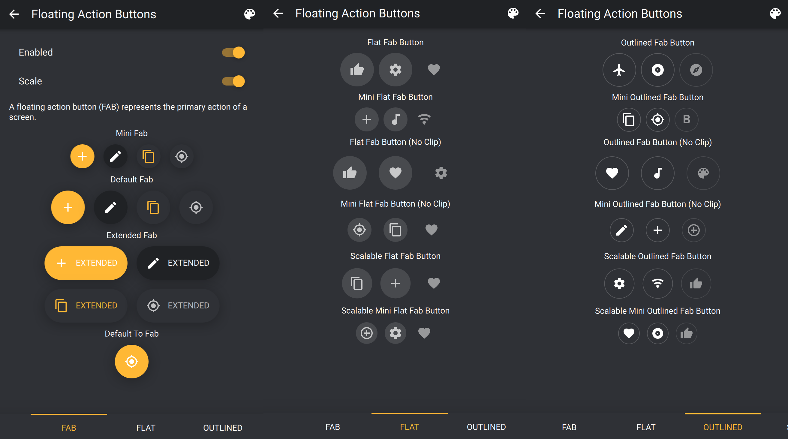
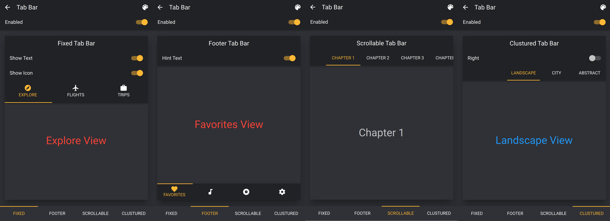
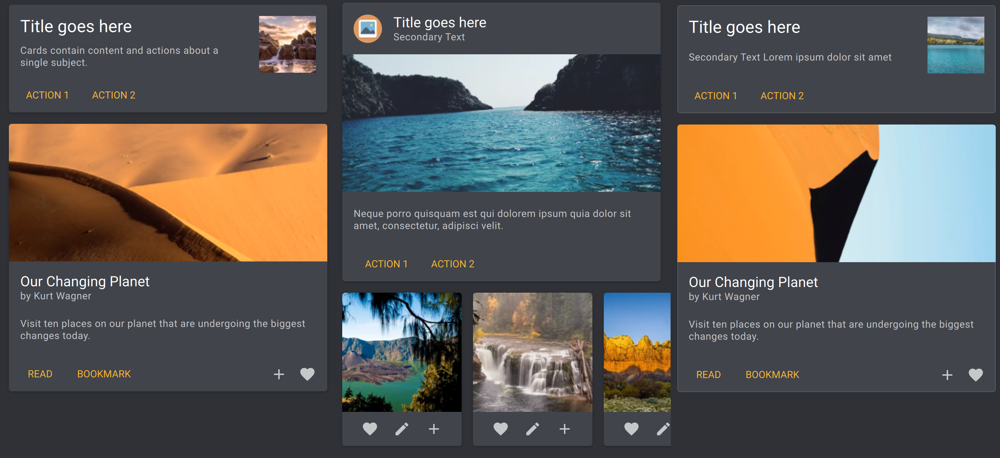

# Qaterial Gallery

QaterialGallery is a showcase application and contains example for the library Qaterial . It is still under development. This library is hard fork of previous library QQuickMaterialHelper.

This project also showcase multiplatform deployment with Qt.

- [x] Windows
- [ ] Linux *(Compile but no deployment)*
- [ ] macOs *(Compile but no deployment)*
- [x] iOs
- [x] Android

## Components

### Main Page


### Menu Bar


### Buttons


### Icons


### Floating Action Button



### Controls Buttons


### Typography


### Text Field


### Tab



### Cards



### Frame


### Group Box


### Snackbars


### Dialogs


DOC TODO

## Build

QaterialGallery is a cross platform application that can be build natively or cross compiled. Qt precompiled binary are required and can be download from the [official website](http://download.qt.io/archive/qt/). Then simply use the qt manager to install the toolchain that you need. Minimum Qt version is `5.12`.

### Windows

To build the application for windows it is required to already be on a windows machine. It is recommended to export the path as global variable.

```bash
export QT_WIN_VERSION=5.12.0
export QT_DIR_MINGW32=C:/Qt/$QT_WIN_VERSION/mingw53_32
export QT_DIR_MINGW64=C:/Qt/$QT_WIN_VERSION/mingw53_64
export QT_DIR_MSVC32=C:/Qt/$QT_WIN_VERSION1/msvc2017_32
export QT_DIR_MSVC64=C:/Qt/$QT_WIN_VERSION/msvc2017_64
```

Then simply clone the repository and create an in source build folder.

```bash
git clone https://github.com/OlivierLdff/QaterialGallery
cd QaterialGallery && mkdir build && cd build
```

**MinGw 32 bits - Make**

```bash
cmake -DCMAKE_PREFIX_PATH=$QT_DIR_MINGW32 \
-G "Unix Makefiles" -DCMAKE_BUILD_TYPE=$QT_BUILD_TYPE path/to/CMakeLists/
```

**MinGw 64 bits - Ninja**

```bash
cmake -DCMAKE_PREFIX_PATH=$QT_DIR_MINGW64 \
-G "Ninja" -DCMAKE_BUILD_TYPE=$QT_BUILD_TYPE path/to/CMakeLists/
```

**Msvc 32 bits *(Default)***

```bash
cmake -DCMAKE_PREFIX_PATH=$QT_DIR_MSVC32 \
-G "Visual Studio 15 2017" path/to/CMakeLists/
```

**Msvc 64 bits**

```bash
cmake -DCMAKE_PREFIX_PATH=$QT_DIR_MSVC64 \
-G "Visual Studio 15 2017 Win64" path/to/CMakeLists/
```

### Linux

*TODO*

### Mac

*TODO*

### Android

#### Requirement

- [Android SDK Tools](https://developer.android.com/studio/index.html)
- [The Android NDK](http://developer.android.com/tools/sdk/ndk/index.html) *If installing Android Studio ndk comes with the SDK in `$SDK_PATH/ndk_bundle/`*.
- [Java SE Development Kit](http://www.oracle.com/technetwork/java/javase/downloads/jdk7-downloads-1880260.html) (JDK) v6 or later. You can also use [OpenJDK](http://openjdk.java.net/) on Linux.

#### Environment variable

You need to the following environment variable to be set.

- `ANDROID_SDK` : Path to the Android Sdk.
- `ANDROID_NDK` : Path to the Android Ndk
- `JAVA_HOME` : Path to the Java (mainly to use the jarsigner utility).

To build the application for windows it is required to already be on a windows machine. It is recommended to export the path as global variable.

```bash
export QT_ANDROID_VERSION=5.12.0
## On Windows
export QT_DIR_ARMV7A=C:/Qt/$QT_ANDROID_VERSION/android_armv7
export QT_DIR_ARM64V8A=C:/Qt/$QT_WIN_VERSION1/android_arm64_v8a
export QT_DIR_X86=C:/Qt/$QT_WIN_VERSION/android_x86
## On UNIX system
export QT_DIR_ARMV7A=Path/To/Qt/$QT_ANDROID_VERSION/android_armv7
export QT_DIR_ARM64V8A=Path/To/Qt/$QT_WIN_VERSION1/android_arm64_v8a
export QT_DIR_X86=Path/To/Qt/$QT_WIN_VERSION/android_x86
## On macOs
export QT_USER_ID=$(id -un)
export QT_DIR_ARMV7A=/Users/$QT_USER_ID/Qt/$QT_ANDROID_VERSION/android_armv7
export QT_DIR_ARM64V8A=/Users/$QT_USER_ID/Qt/$QT_WIN_VERSION1/android_arm64_v8a
export QT_DIR_X86=/Users/$QT_USER_ID/Qt/$QT_WIN_VERSION/android_x86
```

**CMAKE_BUILD_TYPE** can be set to multiple values. *Debug | Release | MinSizeRel | RelWithDebInfo*.

*Tip for windows: If you don't have make installed you can use the one in the ndk:*

```bash
-DCMAKE_MAKE_PROGRAM="$ANDROID_NDK/prebuilt/windows-x86_64/bin/make.exe"
```

#### Arm v7a

```bash
mkdir build-android-armeabi-v7a && cd build-android-armeabi-v7a
cmake -DQT_DIR=$QT_DIR_ARMV7A -G "Unix Makefiles" \
-DCMAKE_TOOLCHAIN_FILE=$ANDROID_NDK/build/cmake/android.toolchain.cmake \
-DCMAKE_BUILD_TYPE=Release \
-DANDROID_ABI=armeabi-v7a \
-DANDROID_NATIVE_API_LEVEL=27 \
-DANDROID_STL=c++_shared \
-DANDROID_TOOLCHAIN=clang \
-DQATERIALGALLERY_BUILD_SHARED=ON \
-DQATERIALGALLERY_ANDROID_KEYSTORE=Path/To/Keystore \
-DQATERIALGALLERY_ANDROID_KEYSTORE_ALIAS=KeystoreAlias \
-DQATERIALGALLERY_ANDROID_KEYSTORE_PASSWORD=xxxx \
..
make -j8
```

The resulted apk will be in `QaterialGallery-armeabi-v7a/build/outputs/apk/release/`.

#### Arm64 v8a

```bash
mkdir build-android-arm64-v8a && cd build-android-arm64-v8a
cmake -DQT_DIR=$QT_DIR_ARM64V8A -G "Unix Makefiles" \
-DCMAKE_TOOLCHAIN_FILE=$ANDROID_NDK/build/cmake/android.toolchain.cmake \
-DCMAKE_BUILD_TYPE=Release \
-DANDROID_ABI=arm64-v8a \
-DANDROID_NATIVE_API_LEVEL=27 \
-DANDROID_STL=c++_shared \
-DANDROID_TOOLCHAIN=clang \
-DQATERIALGALLERY_ANDROID_KEYSTORE=Path/To/Keystore \
-DQATERIALGALLERY_ANDROID_KEYSTORE_ALIAS=KeystoreAlias \
-DQATERIALGALLERY_ANDROID_KEYSTORE_PASSWORD=xxxx \
..
make -j8
```

The resulted apk will be in `QaterialGallery-arm64-v8a/build/outputs/apk/release/`.

#### x86

```bash
mkdir build-android-x86 && cd build-android-x86
cmake -DQT_DIR=$QT_DIR_X86 -G "Unix Makefiles" \
-DCMAKE_TOOLCHAIN_FILE=$ANDROID_NDK/build/cmake/android.toolchain.cmake \
-DCMAKE_BUILD_TYPE=Release \
-DANDROID_ABI=x86 \
-DANDROID_NATIVE_API_LEVEL=27 \
-DANDROID_STL=c++_shared \
-DANDROID_TOOLCHAIN=clang \
-DQATERIALGALLERY_BUILD_SHARED=ON \
-DQATERIALGALLERY_ANDROID_KEYSTORE=Path/To/Keystore \
-DQATERIALGALLERY_ANDROID_KEYSTORE_ALIAS=KeystoreAlias \
-DQATERIALGALLERY_ANDROID_KEYSTORE_PASSWORD=xxxx \
..
make -j8
```

The resulted apk will be in `QaterialGallery-x86/build/outputs/apk/release/`.

### Ios

**Prerequisite:**

- Be on recent version of [macOs](https://www.apple.com/fr/macos/mojave/).
- Latest Version of [XCode](https://developer.apple.com/xcode/).
- [Qt](https://www.qt.io/) compiled for iOs as static library.
- [iOs CMake Toolchain](https://github.com/OlivierLDff/IosCMakeToolchain).
- Generate Qt Import Plugin statement. See [these macros](https://github.com/OlivierLDff/QtStaticCMake).
- An [Apple Developer Licence](https://developer.apple.com/) if you want to deploy on real device.

**Prepare Environment:**

If you installed official Qt binary, Qt Sdk binary is located in:

```bash
export QT_USER_ID=$(id -un)
export QT_IOS_VERSION=5.12.0
export QT_IOS_DIR=/Users/$QT_USER_ID/Qt/$QT_IOS_VERSION/ios
```

**Run CMake:**

Then simply run CMake with [this toolchain](https://github.com/OlivierLDff/IosCMakeToolchain). Read the toolchain README for more information.

```bash
cmake -DCMAKE_PREFIX_PATH=$QT_IOS_DIR \
-DDEPLOYMENT_TARGET=11.0 \
-DCMAKE_TOOLCHAIN_FILE=/path/to/ios.toolchain.cmake \
-DPLATFORM=OS64COMBINED \
-DENABLE_BITCODE=FALSE \
-DTEAM_ID=AAAAAAAA \
-DSTATIC_QT=ON \
-G "XCode" \
path/to/Projet/
```

**Build:**

Then you can simply build your app:

```bash
cmake --build . --config Release
```

or launch the generated XCode project.

**Notes**

- **OS64COMBINED** is only available if you are using CMake 3.14+.
- Generator **XCode** is required to sign app and create a bundle app.
- Replace **TEAM_ID** with your id. Run `/usr/bin/env xcrun security find-identity -v -p codesigning` to see availables Ids.
- **Qt 5.12**:
  - If you use prebuild qt ios library, then bitcode is disabled.
  - Library is build with minimum Os support 11.0. You need to do the same.

## Configuration

### Input

*Note: Exe, Shared and Static can't be ON at the same time.*

* **QATERIALGALLERY_BUILD_SHARED** : Build as a shared library [ON OFF]. *Default: OFF*.
* **QATERIALGALLERY_BUILD_STATIC** : Build as a static library [ON OFF]. *Default: OFF*.
* **QATERIALGALLERY_BUILD_EXE** : Build as an executable [ON OFF]. *Default: ON*.
* **QATERIALGALLERY_PROJECT** : Name of the project. *Default: QaterialGallery*.
* **QATERIALGALLERY_TARGET** : Name of the project. *Default: QaterialGallery*.
* **QATERIALGALLERY_USE_NAMESPACE** : Should the library be compiled with a namespace. *Default: ON*.
* **QATERIALGALLERY_NAMESPACE** : Namespace of the library ig **QATERIALGALLERY_USE_NAMESPACE** is ON. *Default : Qqmh.*

### Dependencies

### Output

* **QATERIALGALLERY_TARGET** : Output target to link to. *Default: QaterialGallery*

## Versions

To create a new release:

* Update in `CMakelist.txt` variables **QATERIALGALLERY_VERSION_MAJOR**, **QATERIALGALLERY_VERSION_MINOR**, **QATERIALGALLERY_VERSION_PATCH**.
* Increment in `platform/PostBuildPlatform.cmake` the parameter **VERSION_CODE** in the android apk macro

## Authors

* [Olivier Le Doeuff](https://github.com/OlivierLDff)
